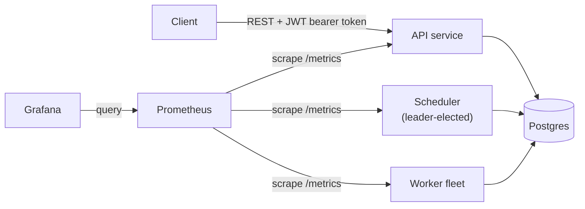

# taskflow

taskflow is a distributed job scheduler written in Go. Clients submit one-shot or
cron-recurring jobs — optionally depending on other jobs to form a DAG — through a
JWT-authenticated REST API. A leader-elected scheduler continuously promotes jobs that
are due and whose dependencies have succeeded into pending runs, and a fleet of workers
leases those runs, executes them, and retries with exponential backoff before
dead-lettering permanently failed attempts.

## Architecture



Postgres is both the system of record for job/run metadata *and* the queue: workers
claim runs with `SELECT ... FOR UPDATE SKIP LOCKED` instead of a separate broker, and
the scheduler's leader election uses a Postgres advisory lock instead of a separate
consensus system. See [docs/ARCHITECTURE.md](docs/ARCHITECTURE.md) for why, and the
trade-offs that come with it.

## Quickstart

No local setup at all: open this repo in a free [GitHub Codespace](https://github.com/features/codespaces)
(`.devcontainer/devcontainer.json` is already configured with Go + Docker-in-Docker)
and run the command below there.

```bash
docker compose up --build
```

This brings up Postgres, the `api`, `worker`, and `scheduler` binaries (each running
migrations on startup), plus Prometheus (`:9093`) and Grafana (`:3000`). The API listens
on `:8080`.

### Getting a token

There is no login endpoint — `api` is a single shared-admin-secret service (see
`internal/api/auth.go`). Any HS256 JWT signed with the `JWT_SECRET` the API was started
with (the docker-compose default is `dev-secret-change-me`) is accepted as
`Authorization: Bearer <token>`; the token's subject/claims aren't checked against
anything beyond signature and expiry. For local dev, mint one with the `api.MintToken`
helper via a throwaway script inside the module (it needs to live under
`github.com/manavsingla/taskflow` to import the `internal/api` package):

```go
// scripts/mint-token/main.go — delete after use, or keep it as a dev-only tool
package main

import (
	"fmt"
	"time"

	"github.com/manavsingla/taskflow/internal/api"
)

func main() {
	tok, err := api.MintToken("dev-secret-change-me", "local-dev", 24*time.Hour)
	if err != nil {
		panic(err)
	}
	fmt.Println(tok)
}
```

```bash
go run ./scripts/mint-token
export TOKEN="<paste the printed token>"
```

### Submit a job, check its status, list its runs

```bash
# Submit a one-shot job
curl -s -X POST localhost:8080/v1/jobs \
  -H "Authorization: Bearer $TOKEN" \
  -H "Content-Type: application/json" \
  -d '{"name": "echo", "payload": {"hello": "world"}}' | tee /tmp/job.json

JOB_ID=$(jq -r .id /tmp/job.json)

# Poll status
curl -s localhost:8080/v1/jobs/$JOB_ID -H "Authorization: Bearer $TOKEN"

# List its runs once the scheduler has promoted and a worker has picked it up
curl -s localhost:8080/v1/jobs/$JOB_ID/runs -H "Authorization: Bearer $TOKEN"
```

The `worker` binary registers three example handlers keyed by job `name`: `echo`
(returns the payload unchanged), `sleep` (sleeps `payload.seconds`, useful for
exercising the timeout/retry path), and `http_call` (makes an HTTP request described by
`payload.url`/`payload.method`).

Full endpoint reference: [docs/API.md](docs/API.md).

## What this project demonstrates

- **REST API design** — resource-oriented routes, input validation, idempotent create,
  consistent JSON error shapes (`internal/api/handlers.go`, `internal/api/router.go`)
- **Postgres-as-queue** — `SELECT ... FOR UPDATE SKIP LOCKED` for lease claiming instead
  of a second broker (`internal/store/postgres.go: LeaseNextRun`)
- **Read replica** — a real streaming Postgres hot standby (bootstrapped via
  `pg_basebackup`), with pure-read API queries routed to it opt-in via
  `REPLICA_DATABASE_URL`; writes and leasing always stay on the primary
  (`docker/Dockerfile.postgres-replica`, `internal/store/postgres.go: EnableReadReplica`)
- **Leader election via advisory locks** — `pg_try_advisory_lock` gates which scheduler
  replica promotes (`internal/lock`)
- **DAG dependency resolution** — jobs can depend on other jobs; promotion checks that
  every dependency's latest run succeeded (`internal/scheduler/schedule.go`)
- **Cron parsing** — `robfig/cron` standard expressions, anchored to last-scheduled or
  creation time (`internal/scheduler/schedule.go: NextRunDue`)
- **Retry/backoff and dead-lettering** — exponential backoff capped at 5 minutes,
  attempts-exhausted runs land in `dead_letters` (`internal/worker/pool.go`)
- **Crash recovery** — lease expiry + a janitor loop reclaims runs orphaned by a dead
  worker (`internal/worker/janitor.go`)
- **JWT auth** — shared-secret HS256 bearer tokens (`internal/api/auth.go`)
- **Hand-rolled rate limiting** — per-IP in-memory token bucket, no external dependency
  (`internal/api/ratelimit.go`)
- **Redis cache-aside layer** — caches job/run reads with stampede protection
  (singleflight) and real invalidation on writes, opt-in via `REDIS_ADDR`
  (`internal/cache/`)
- **Observability** — Prometheus metrics from all three services, scraped and graphed
  via Grafana (`docker/prometheus/prometheus.yml`); OpenTelemetry distributed tracing
  via a bundled Jaeger, instrumenting every HTTP request and every Postgres query
  automatically (`internal/tracing/`, `internal/store/tracing.go`)
- **Infra as code** — Docker Compose for local dev, Kubernetes manifests (applied and
  verified against a real cluster, HPAs scaling on real metrics-server readings —
  see [VERIFICATION.md](docs/VERIFICATION.md#kubernetes)), Terraform for AWS
  (ECS/RDS/ALB), and a GitHub Actions CI pipeline (`k8s/`, `terraform/`,
  `.github/workflows/ci.yml`)

Read more: [docs/ARCHITECTURE.md](docs/ARCHITECTURE.md) (design decisions and
trade-offs), [docs/API.md](docs/API.md) (endpoint reference),
[docs/VERIFICATION.md](docs/VERIFICATION.md) (real load test numbers, rate-limit
enforcement, and a crash-recovery chaos test — not just claims), and
[docs/DEVLOG.md](docs/DEVLOG.md) (how this was built).
