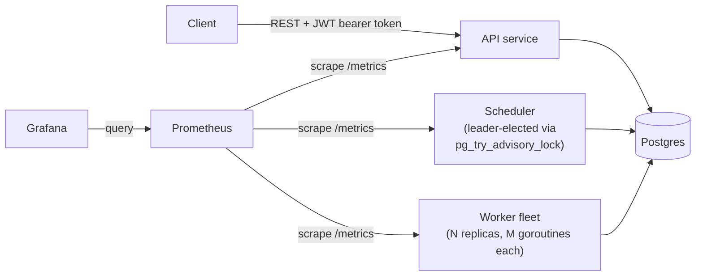
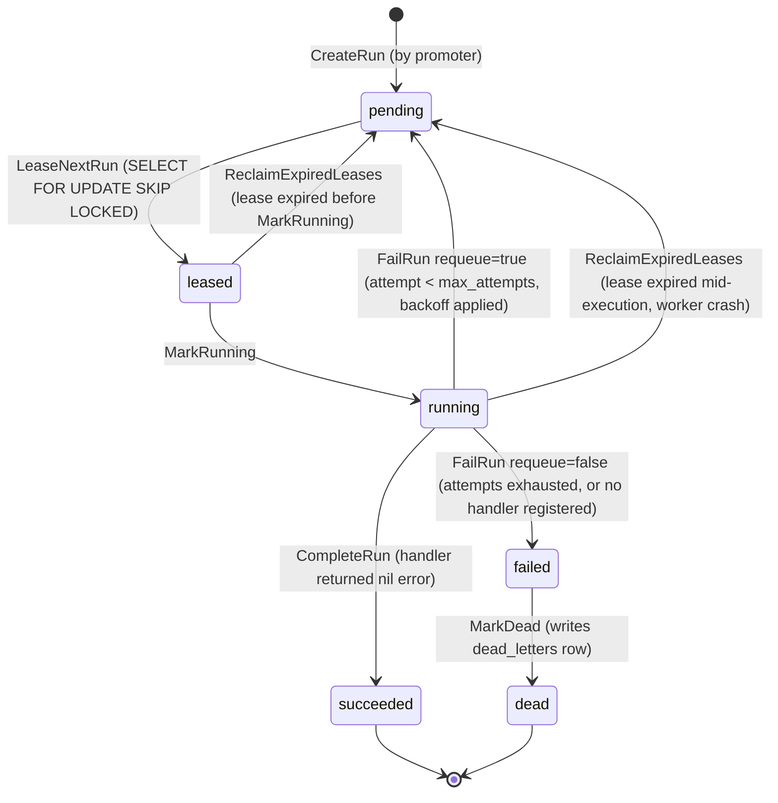

# Architecture

## Overview

Three independent binaries (`cmd/api`, `cmd/scheduler`, `cmd/worker`) share one Postgres
database as both system of record and queue. Each runs its own migrations on startup
(`store.RunMigrations`, idempotent — tracked in `schema_migrations`) and exposes a
Prometheus metrics endpoint on `:9090` in addition to its main job.

## Job lifecycle

Walking it end to end:

1. **Create** — `POST /v1/jobs` validates the request (name required, `cron_expr` must
   parse, `max_attempts`/`timeout_seconds` defaulted or validated) and inserts a `jobs`
   row plus any `job_dependencies` rows, all in one transaction
   (`PostgresStore.CreateJob`).
2. **Promote** — the elected scheduler leader runs `Promoter.PromoteOnce` on a fixed
   interval (`POLL_INTERVAL`). For every `active` job (bounded `ListJobs` scan, see
   Limitations) it skips jobs with an already-active run, checks `NextRunDue` (one-shots
   fire once; recurring jobs use `robfig/cron` anchored to their last `scheduled_at` or,
   for a brand-new job, `created_at`), checks `DependenciesSatisfied` (every dependency's
   *latest* run must be `succeeded`), and if both pass, calls `CreateRun` to insert a
   `pending` `job_runs` row.
3. **Lease** — each worker goroutine loops calling `LeaseNextRun`, which in one
   transaction does `SELECT id, job_id FROM job_runs WHERE status='pending' AND
   scheduled_at <= now() ORDER BY priority DESC, scheduled_at ASC LIMIT 1 FOR UPDATE SKIP
   LOCKED`, then updates that row to `leased`, stamps `leased_by`/`leased_at`/
   `lease_expires_at`, and increments `attempt`. `SKIP LOCKED` means concurrent workers
   never block on or double-claim the same row — each takes the next unlocked candidate.
4. **Execute** — the worker marks the run `running`, looks up a handler by `job.Name`,
   and runs it under a `context.WithTimeout(job.TimeoutSeconds)`. A handler that ignores
   context cancellation and returns success anyway is still treated as failed if the
   context expired.
5. **Finish** — success calls `CompleteRun` (`succeeded`, stores the handler's result).
   Failure with attempts remaining calls `FailRun(requeue=true)`, which resets the run to
   `pending` with `scheduled_at = now() + backoff` (backoff is `2^attempt` seconds,
   capped at 5 minutes) and clears the lease fields, making it eligible for lease again
   without scheduler involvement. Failure with attempts exhausted (or no handler
   registered for the job's name) calls `FailRun(requeue=false)` followed by `MarkDead`,
   which inserts a `dead_letters` row and sets the run to `dead` inside one transaction.
6. **Crash recovery** — a `janitorLoop` on every worker calls `ReclaimExpiredLeases`
   every `5 * PollInterval`, resetting any `leased`/`running` row whose
   `lease_expires_at` has passed back to `pending` — this is what recovers work from a
   worker that died (or was killed) mid-execution, without requiring the dead worker to
   do anything.

## Why Postgres as the queue, not Kafka/SQS

taskflow reuses its transactional store as the job queue via the `SKIP LOCKED` pattern
(`internal/store/postgres.go: LeaseNextRun`) rather than adding a second broker. The
reasoning:

- Scheduling metadata (job status, dependency graph, run history) already needs a
  transactional store with strong consistency — the DAG dependency check
  (`DependenciesSatisfied`) has to read another job's latest run status and act on it
  correctly, which is exactly the kind of read a message queue doesn't give you for
  free.
- Adding Kafka/SQS on top would mean keeping two systems (queue state, DB state) in sync
  — a run could exist in the queue but not the DB, or vice versa, after a partial
  failure — for a workload that doesn't need Kafka's throughput or fan-out/replay
  semantics.

The honest trade-off: this design ceils out at single-node Postgres write throughput.
Every lease is a row-locking transaction against one database; there's no partitioning
or independent scaling of the queue apart from the DB itself. If job volume ever grew
past what one Postgres instance (even a beefy one) can absorb for lease contention, the
next step would be a real rewrite onto Kafka or SQS for the queue layer, keeping
Postgres only for durable job/run metadata. That migration is a genuine architecture
change, not a config tweak — it's the ceiling of this design, not a bug in it.

## Why Postgres advisory locks, not etcd/ZooKeeper, for leader election

`internal/lock` implements `Elector` with `pg_try_advisory_lock`/`pg_advisory_unlock` on
a single dedicated connection held for the elector's lifetime
(`internal/lock/postgres.go`). The alternative would be running etcd or ZooKeeper purely
to decide which scheduler replica promotes.

- Postgres is already the system of record here; the scheduler already has to be
  connected to it to do anything useful. Advisory locks give leader election "for free"
  — no second consensus system to deploy, operate, monitor, and reason about failure
  modes for.
- Advisory locks are session-scoped: if the holding connection dies (process crash,
  network partition, DB restart), Postgres releases the lock automatically, so a stuck
  leader can't wedge the system.

The honest trade-off: leadership availability is now tied to a single Postgres
instance's availability. There's no independent failure domain for "can we elect a
leader" separate from "is the database up" — if Postgres is down, nothing was going to
promote jobs anyway (the job data lives there too), so this isn't adding a new failure
mode in practice, but it does mean leader election has zero autonomy from the data
plane. A system that needed leader election to survive its primary datastore being
unavailable would need etcd/ZooKeeper instead.

## CAP framing

The job-metadata path — create, promote, lease — is deliberately **CP-leaning**: a
double-fire (the same job promoted twice concurrently) or a double-lease (two workers
executing the same run) would be a worse failure than a moment of unavailability, so
every state transition on that path goes through a real Postgres transaction with row
locking (`FOR UPDATE SKIP LOCKED` for leasing, unique constraints plus
`ErrIdempotencyConflict` for job creation). This is the part of the system that must be
linearizable-ish per row — two transactions racing on the same `job_runs` row cannot
both win.

Eventual consistency shows up elsewhere, deliberately:

- **Metrics/dashboards** — Prometheus scrapes every 15s (`docker/prometheus/
  prometheus.yml`); `taskflow_queue_depth` and friends are always some seconds stale.
  That's fine — nothing about correctness depends on the dashboard being current.
- **Worker heartbeats** — `UpsertWorkerHeartbeat` runs on `PollInterval` from a
  background goroutine independent of the lease/execute path; `ListWorkers` can report a
  worker as `alive` slightly after it has actually died. Staleness here just delays an
  operator noticing, not a correctness issue.
- **Leader election polling** — `TryAcquire` is checked once per `Promoter.Run` tick, not
  continuously; a leadership handoff can lag by up to one interval. Acceptable because
  the actual promotion work inside a tick is itself transactional.

## Idempotency

`NewJobInput.IdempotencyKey` lets a client safely retry `POST /v1/jobs` after a timeout
or dropped response: the handler looks up any existing job with that key first and
returns it (`200`, not `201`) instead of creating a duplicate; a genuine race (two
concurrent creates with the same key) is caught by a unique constraint on
`jobs.idempotency_key` and surfaced as `409 idempotency key already used`
(`store.ErrIdempotencyConflict`).

On the execution side, the attempt-based retry/backoff loop guarantees a run is not
silently duplicated by taskflow's own machinery: `LeaseNextRun` increments `attempt`
atomically as part of the same transaction that claims the row, so a crash between
claiming and executing can only be reclaimed by the janitor after the lease expires, not
run concurrently by two workers.

None of this makes job execution exactly-once. taskflow guarantees **at-least-once**
execution: a worker can lease a run, start executing a handler with real side effects,
crash before recording the result, and have the janitor reclaim the run for another
worker to execute again. Handlers with external side effects (an HTTP call, a database
write, a message send) are responsible for their own idempotency (e.g. keying on
`run.ID` or `job.IdempotencyKey`) if that matters for their workload. This is stated
plainly rather than glossed over: taskflow does not solve exactly-once delivery.

## Distributed tracing

All three services export OpenTelemetry traces via OTLP/HTTP when
`OTEL_EXPORTER_OTLP_ENDPOINT` is set (docker-compose points it at a bundled Jaeger
all-in-one; unset, tracing is a no-op so nothing depends on a collector being present).
Two things are instrumented automatically rather than call-site by call-site:

- **Every Postgres query** — `internal/store/tracing.go` implements `pgx.QueryTracer`
  and is wired into the pool once in `store.New`, so all ~25 `Store` methods get a
  `pg.query` span (with the SQL text as an attribute) without editing any of them.
- **Every HTTP request** — `cmd/api/main.go` wraps the router in
  `otelhttp.NewHandler`, so each request gets a root span.

This produces real parent/child traces, not just isolated spans: a `POST /v1/jobs`
request's span is the parent of its `begin` / `INSERT INTO jobs` / `commit` query
spans, verified by hitting a running instance and pulling the trace back out of
Jaeger's API (see [VERIFICATION.md](VERIFICATION.md)) — not just asserted from reading
the code. `internal/worker/pool.go` (`executeOne`) and
`internal/scheduler/promoter.go` (`PromoteOnce`) each get their own span too.

**Limitation, stated plainly:** these traces are per-service, not linked into one
end-to-end trace per job. A request's HTTP span and its DB query spans share a trace
because they're the same process, same context — but the scheduler's later
`PromoteOnce` span and the worker's later `executeOne` span for the *same job* start
new, unrelated traces, because nothing today persists the originating trace ID on the
job/run for the scheduler or worker to continue. Doing that (store a W3C traceparent
on job creation, extract and continue it when promoting and when executing) is the
real next step for a fully linked trace — not implemented here.

## Known limitations / what's not built

- **`Promoter.PromoteOnce` doesn't paginate.** It calls `ListJobs` with a single bounded
  query (`listActiveJobsLimit = 10000`) rather than paging through all active jobs. Past
  some thousands of concurrently active jobs, the overflow is silently never scanned for
  promotion in that pass. The fix is straightforward (loop with limit/offset) but wasn't
  needed for this project's scale and is explicitly out of scope for now
  (`internal/scheduler/promoter.go`).
- **The rate limiter is per-process, in-memory.** `internal/api/ratelimit.go` implements
  a token bucket keyed by client IP inside a single Go map — it does not coordinate
  across API replicas, so a client hitting a load-balanced fleet gets one bucket per
  replica it happens to land on, not one global quota. A shared limiter (Redis or
  similar) would be needed to enforce a single true limit per client across a scaled-out
  API.
- **No multi-tenant auth.** `internal/api/auth.go` verifies any HS256 token signed with
  one shared `JWT_SECRET`; there's no per-subject scoping, no revocation, no notion of
  "this caller may only see their own jobs." Every valid token has full admin access to
  every job in the system. That's a deliberate scope boundary for what is currently an
  admin-facing service, not an oversight — but it means taskflow is not safe to expose
  to untrusted or mutually-distrusting callers as-is.
